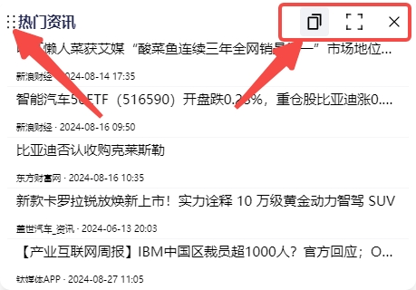

# 组件导出图片并复制

## 目的
组件转图片并复制到剪贴板粘贴到富文本编辑器中

## 工具库
> [html-to-image](https://github.com/bubkoo/html-to-image) 
> 
> [vueUse: useClipboardItems](https://vueuse.org/core/useClipboardItems/#useclipboarditems)

## 思路

1. 获取组件的 dom 节点并转成图片
2. 将图片复制到剪贴板

## 问题

1. 获取组件的 dom 节点时会获取一些非必要的节点
   
2. 开始使用 useClipboard,但是只能复制文本，在富文本编辑器中粘贴时,粘贴的是纯文本（base64），不能直接粘贴图片
3. 本地测试通过了,但在打包之后发到测试的时候就会报错,报错信息如下:
   > ReferenceError: ClipboardItem is not defined
   

## 解决方案

1. 开始我的思路是新增一个`isTranslating`变量来控制节点的显隐,但是即使使用了`nextTick`还是会在元素隐藏之前执行导出图片,后面发现html-to-image 有一个配置项`filter`，可以过滤掉不需要的节点,通过给节点添加一个 class，然后过滤掉这个 class 即可
   ```js
   const image = await elementToPng(dashboardItemRef.value, {
     filter: (node: HTMLElement) => {
       const exclusionClasses = ["secret-element"];
       return !exclusionClasses.some((className) => node.classList?.contains(className));
     },
   });
   ```
  
2. 将图片复制到剪贴板,后来使用 useClipboardItems，可以复制图片

   1. useClipboard

   ```js
   import { useClipboard } from "@vueuse/core";

   const { copy } = useClipboard();

   const image = await elementToPng.toPng(element, options); //自己内部实现了一个blobToDataURL方法可以获取图片的url
   copy(image); //复制的是链接
   ```

   2. useClipboardItems

   ```js
   import { useClipboardItems } from "@vueuse/core";

   const { copy } = useClipboardItems();
   const image = await elementToPng(dashboardItemRef.value, {
     width: width.value,
     height: height.value,
     filter: (node: HTMLElement) => {
       const exclusionClasses = ["secret-element"];
       return !exclusionClasses.some((className) => node.classList?.contains(className));
     },
   });
   if (!image) return;
   await copy([new ClipboardItem({ ["image/png"]: image })]);
   ```
  
3. ClipboardItem 只能在Https和localhost环境下使用,在Http环境下会抛出异常,因为最终到生产还是是https的,所以只需要把测试的域名也配置https访问即可
